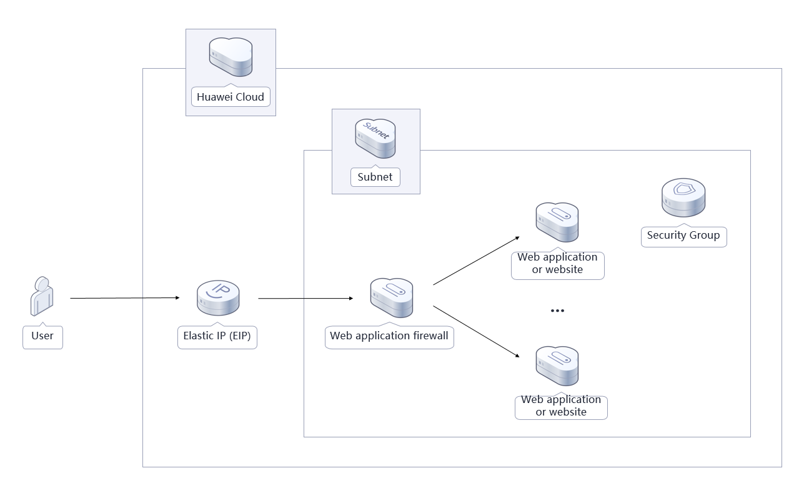

[TOC]

**Solution Overview**
===============
This solution helps you deploy a web application firewall (WAF) on Huawei Cloud ECSs in just a few clicks with open-source software ModSecurity. This solution works with Nginx to deliver flexible, secure, and durable web applications. ModSecurity is an open-source cross-platform web application firewall (WAF). It can protect websites by checking incoming and outgoing requests to and from web servers.

For more details about this solution, visit: https://www.huaweicloud.com/intl/en-us/solution/implementations/bwafm.html


**Architecture**
---------------


**Architecture Description**
---------------
This solution will:
1. Create a Linux ECS for installing a WAF and running Nginx.
2. Install and configure Nginx on the Linux ECS to balance loads.
3. Install and configure ModSecurity on the Linux ECS to enable a WAF.
4. Assign an EIP and bind it to the web server so that the server can communicate with the Internet.


**File Structure**
---------------
``` lua
huaweicloud-solution-build-a-WAF-based-on-modsecurity
├── build-a-WAF-based-on-modsecurity.tf.json -- Resource orchestration template
├── userdata
    ├── configure_nginx_modsecurity.sh -- Script configuration file
```
**Getting Started**
---------------
1. Use a remote connection tool to log in to the load balancer and upload an SSL certificate (public and private keys) to the specified directory /usr/local/nginx/ssl/. For details, see Uploading a File to an ECS. Run the "cd /usr/local/nginx/sbin; ./nginx" command to start the Nginx service.

	Figure1 Uploading an SSL certificate and starting the Nginx service

	

2. Configure domain name resolution. Resolve the website domain name to the public IP address mapped to its private IP address. In this way, you can use a browser to access the website over its domain name. For details about DNS resolution, see [Configuring Record Sets for a Website](https://support.huaweicloud.com/intl/en-us/productdesc-dns/en-us_topic_0035920135.html)

3. Use a browser to access the EIP or domain name through HTTP/HTTPS many times to verify that requests are distributed across backend service servers. For example, http:// EIP, http:// Domain name, https:// EIP, https:// Domain name, or just the domain name.

	Figure2 Accessing the EIP mapped to the private IP address

	

4. Enter "https:// EIP of the WAF ECS/?param=?param=%22%3E%3Cscript%3Ealert(1);%3C/script%3E" in the browser address box and check whether WAF takes effect.

	Figure3 Testing WAF

	


